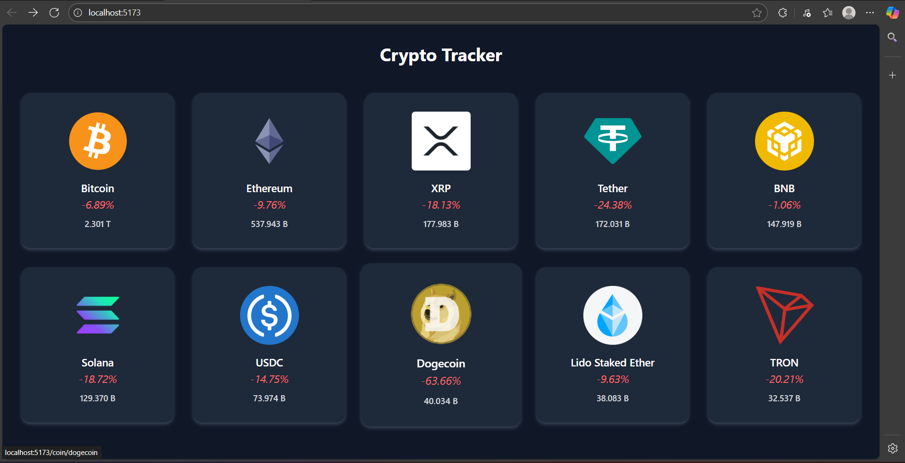
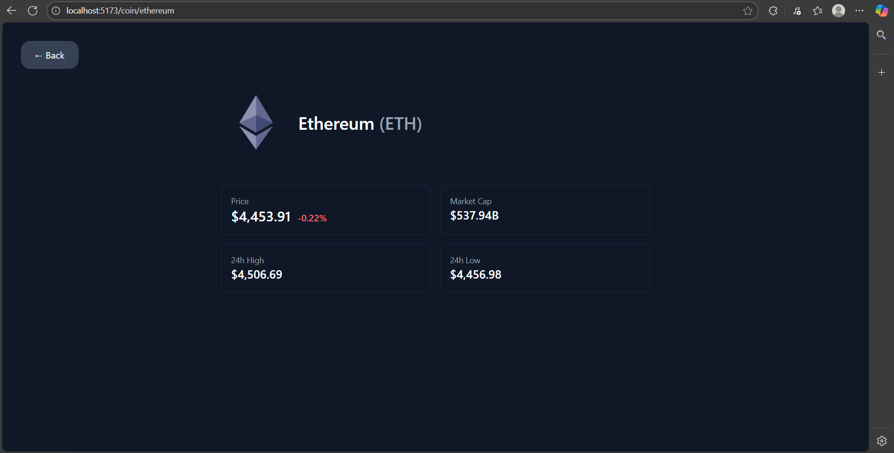

# 💹 Crypto Tracker (React + Vite + Tailwind + Recharts)

A modern **cryptocurrency tracking app** built with **React**, **Vite**, and **TailwindCSS**, powered by the **CoinGecko API**.  
Search, explore, and dive into real-time crypto data with a clean UI and smooth UX.  

---

## ✨ Features
- 🔍 **Search coins** instantly by name or symbol  
- 📊 **Market stats** (price, market cap, volume, rank)  
- 📈 **Interactive price history chart** (powered by Recharts)  
- 🦴 **Skeleton loaders** for a professional loading state  
- 🎨 Fully responsive, polished UI with TailwindCSS  

---

## 🛠️ Tech Stack
- [React](https://react.dev/) – UI library  
- [Vite](https://vitejs.dev/) – Blazing fast dev/build tool  
- [TailwindCSS](https://tailwindcss.com/) – Utility-first styling  
- [Recharts](https://recharts.org/en-US/) – Simple charting library for React  
- [CoinGecko API](https://www.coingecko.com/en/api) – Free crypto market data  

---

## 🌍 Live Demo
[Click Here](https://crypto-tracker-react-tailwind.netlify.app/) 

---

# Screenshots

## Home Page

## Details Page

---

## 📌 Notes
- Search works across all listed coins (case insensitive).  
- Charts display **7-day price history** (more ranges coming soon).  
- Responsive design for desktop + mobile users.  

---

© MIT LICENSE 
